# Public Service - API Flow Diagrams

## Service Management APIs

### 1. Create Service - POST /public-service/v1/service

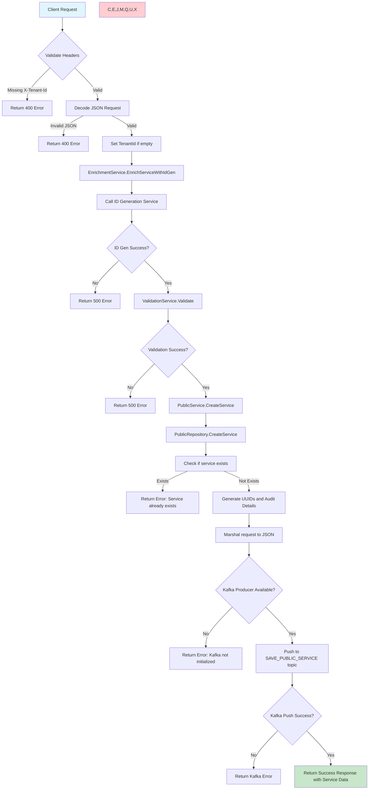

### 2. Search Service - GET /public-service/v1/service

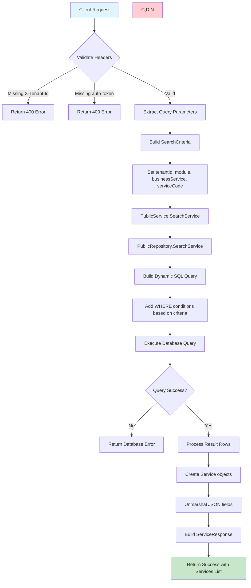

### 3. Update Service - PUT /public-service/v1/service/{serviceCode}

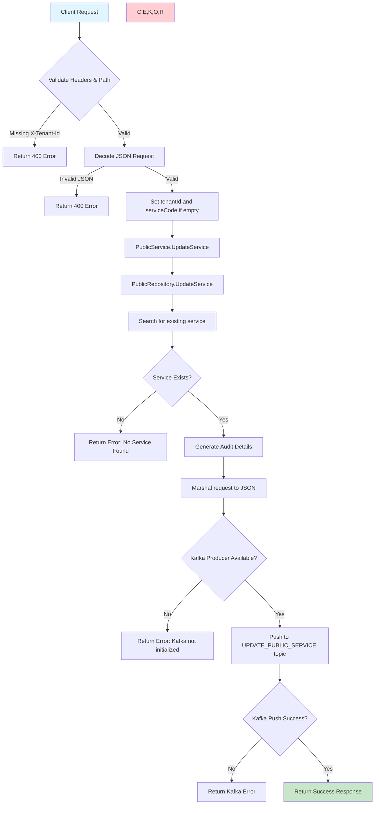

## Application Management APIs

### 4. Create Application - POST /public-service/v1/application/{serviceCode}

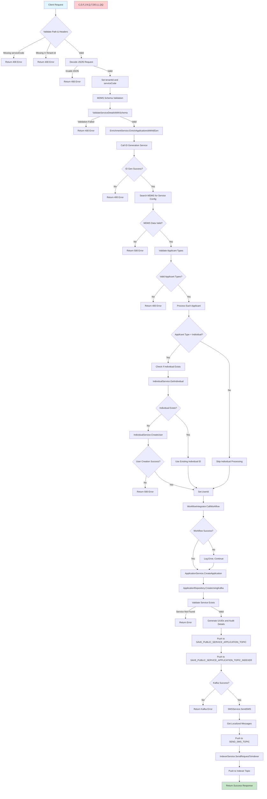

### 5. Search Application - GET /public-service/v1/application/{serviceCode}

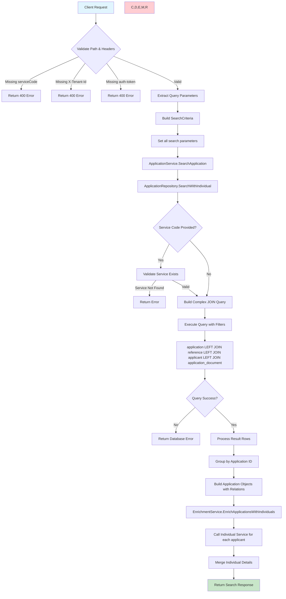

### 6. Update Application - PUT /public-service/v1/application/{serviceCode}

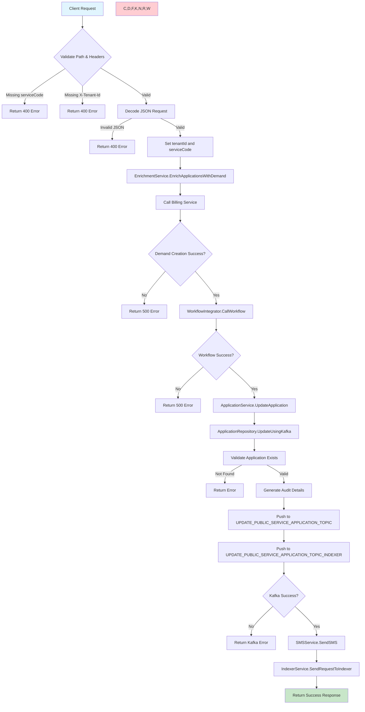

### 7. Search My Applications - GET /public-service/v1/application

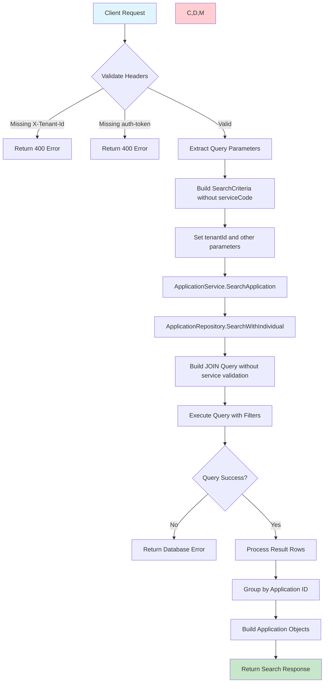

### 8. Calculate - POST /public-service/_calculate

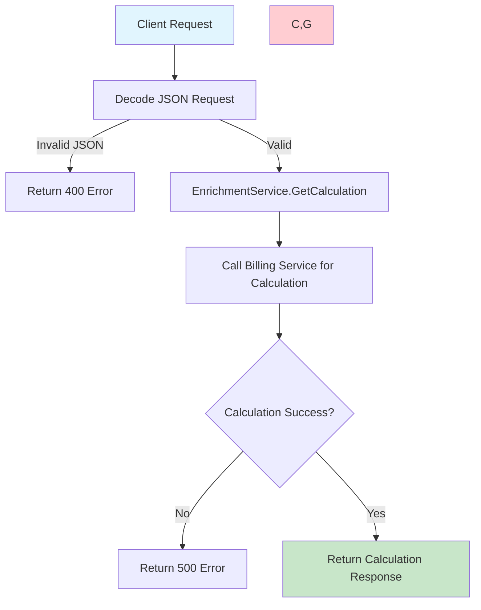

### 9. Delete MDMS Schema - POST /public-service/_deleteMDMSSchema

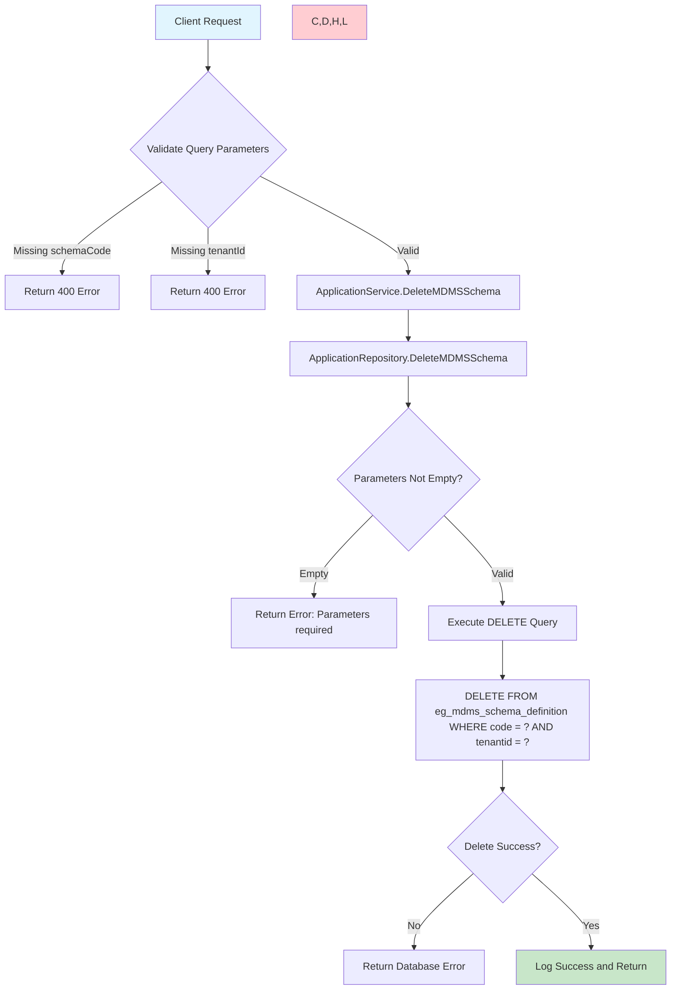

## Kafka Consumer Flow

### Payment Consumer - egov.collection.payment-create

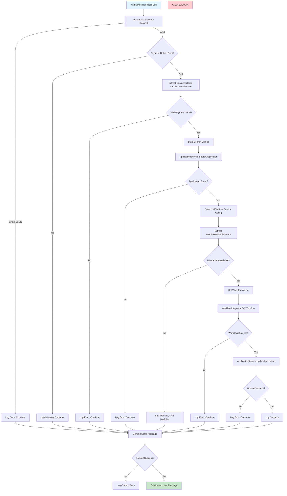

## ChecklistService Flow

### GetChecklist Method

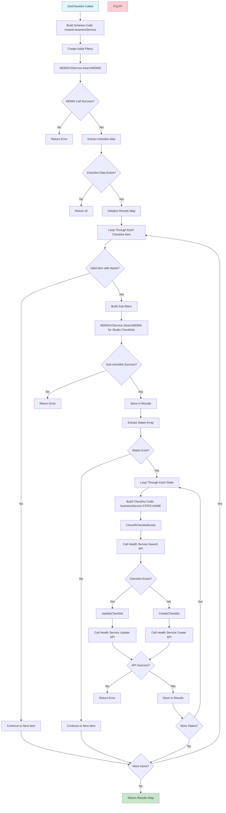

## External Service Call Patterns

### MDMS Service Calls

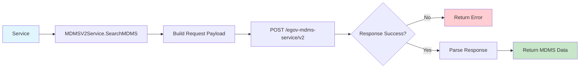

### Individual Service Calls

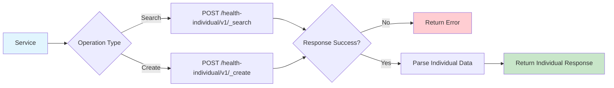

### Workflow Service Calls

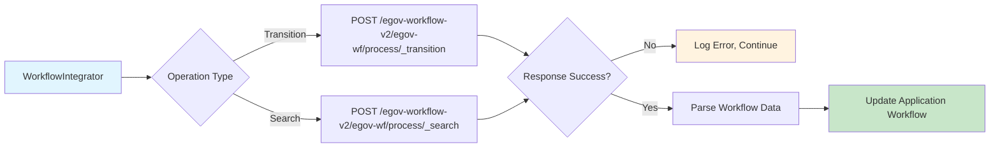

### ID Generation Service Calls

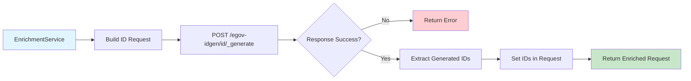

These flow diagrams show the complete request-response cycle for each API endpoint, including all validation steps, external service calls, database operations, and error handling paths.