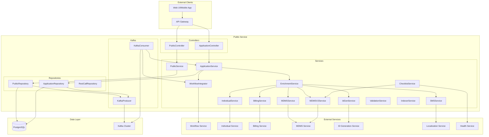
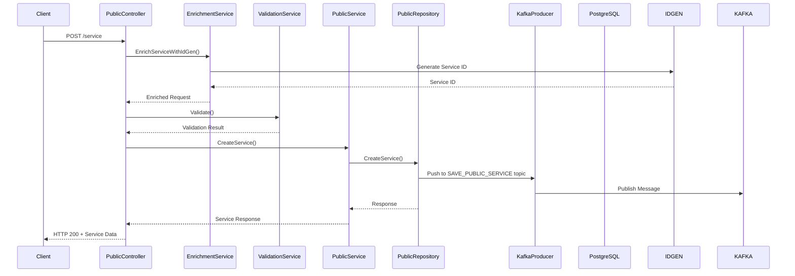
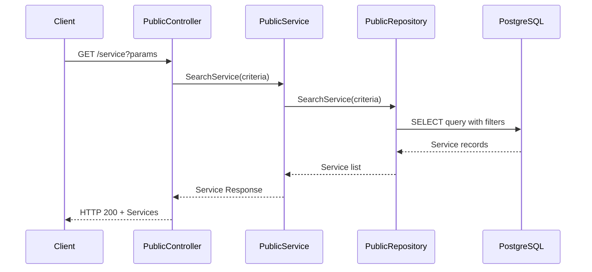
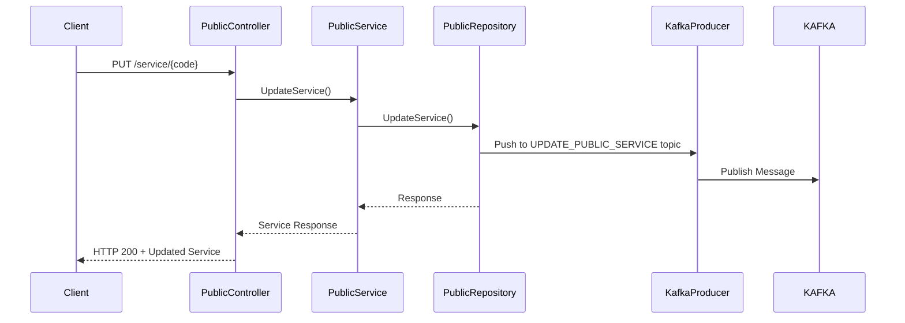
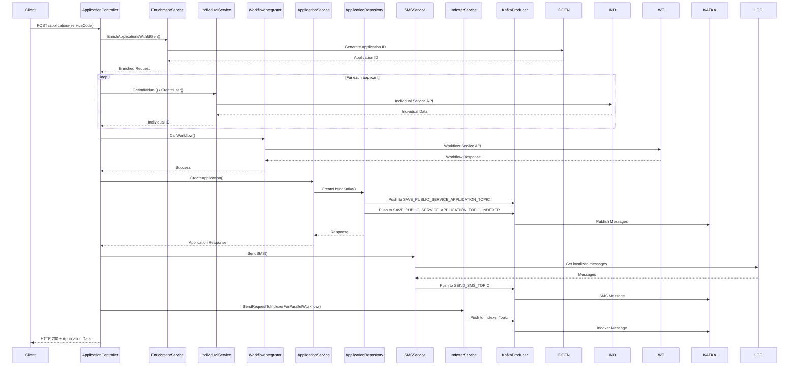
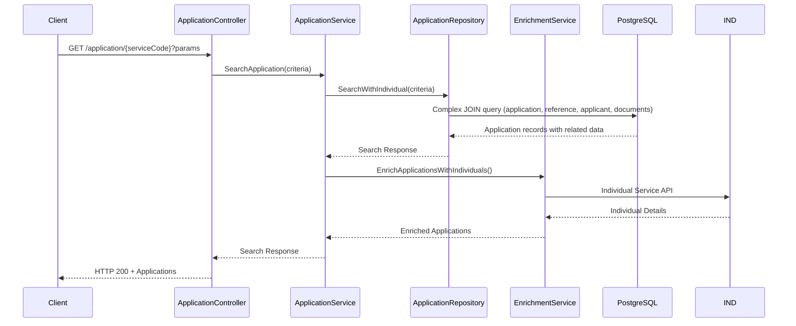
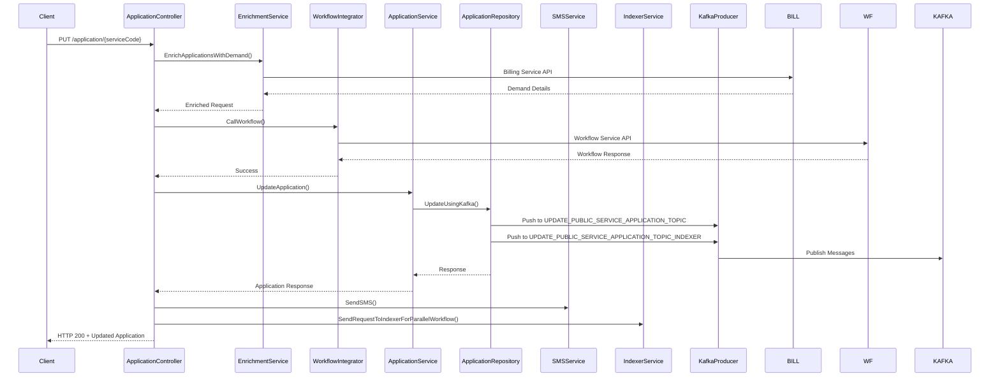
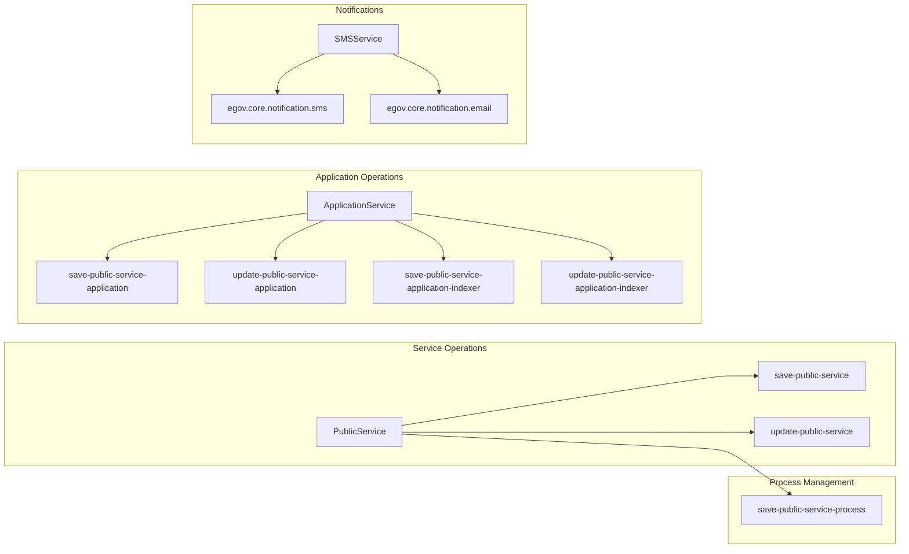
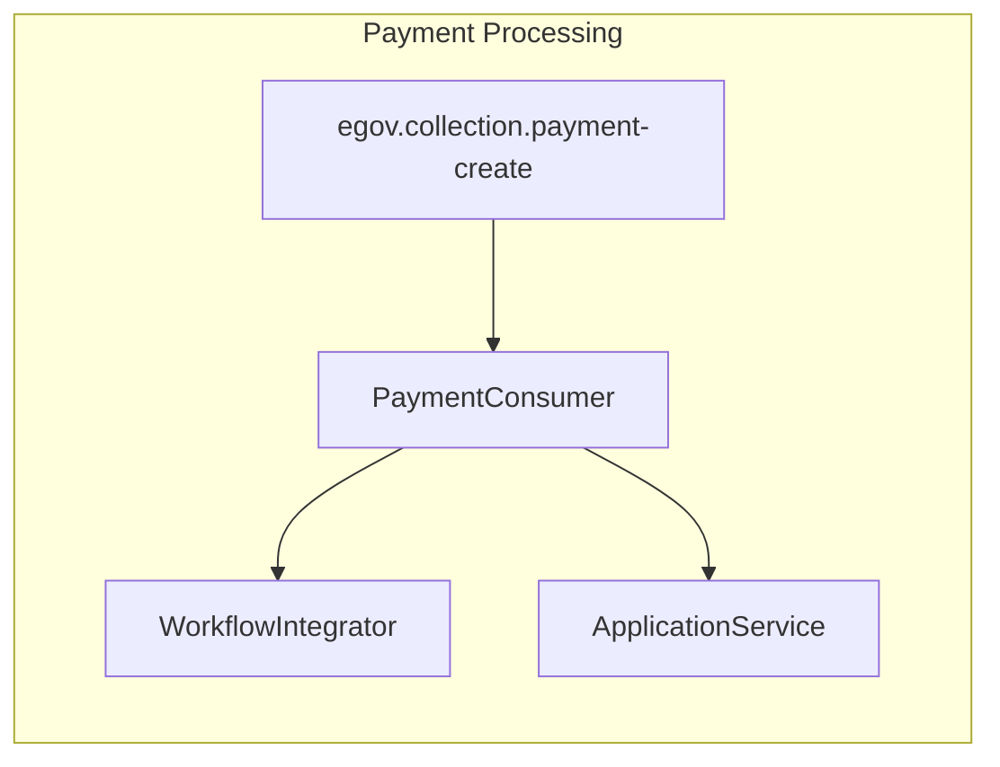
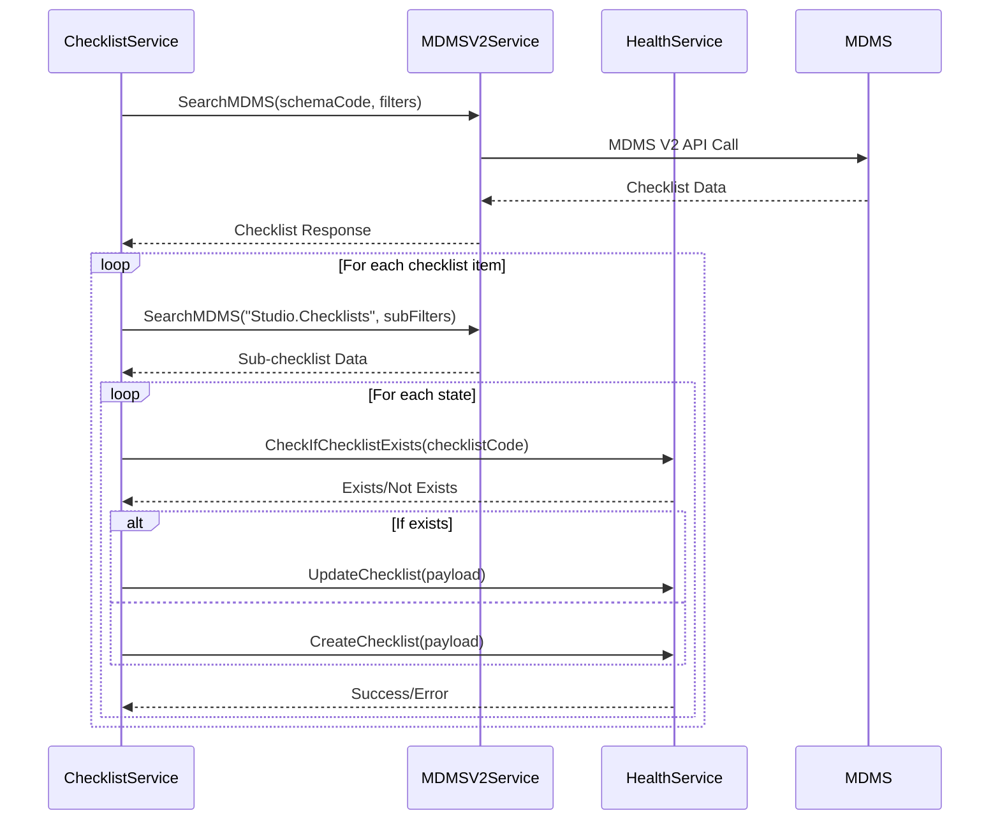

# Public Service - Design Document

## Overview
The Public Service is a microservice that manages public services and applications within the DIGIT ecosystem. It provides APIs for creating, updating, and searching services and applications, with workflow integration.

## Service Architecture Diagram



## API Endpoints and Flow

### Service Management APIs

#### 1. Create Service
**Endpoint:** `POST /public-service/v1/service`



#### 2. Search Service
**Endpoint:** `GET /public-service/v1/service`



#### 3. Update Service
**Endpoint:** `PUT /public-service/v1/service/{serviceCode}`



### Application Management APIs

#### 1. Create Application
**Endpoint:** `POST /public-service/v1/application/{serviceCode}`



#### 2. Search Application
**Endpoint:** `GET /public-service/v1/application/{serviceCode}`



#### 3. Update Application
**Endpoint:** `PUT /public-service/v1/application/{serviceCode}`



## Database Schema

### Core Tables

```sql
-- Service Table
CREATE TABLE service (
    id UUID PRIMARY KEY,
    tenant_id VARCHAR NOT NULL,
    module VARCHAR NOT NULL,
    business_service VARCHAR NOT NULL,
    status VARCHAR NOT NULL,
    service_code VARCHAR UNIQUE NOT NULL,
    additional_details JSONB,
    createdby UUID NOT NULL,
    last_modifiedby UUID NOT NULL,
    created_at TIMESTAMP DEFAULT NOW(),
    updated_at TIMESTAMP DEFAULT NOW()
);

-- Application Table
CREATE TABLE application (
    id UUID PRIMARY KEY,
    tenant_id VARCHAR NOT NULL,
    module VARCHAR NOT NULL,
    business_service VARCHAR NOT NULL,
    status VARCHAR NOT NULL,
    channel VARCHAR,
    application_number VARCHAR UNIQUE NOT NULL,
    workflow_status VARCHAR,
    service_code VARCHAR NOT NULL,
    service_details JSONB,
    additional_details JSONB,
    address JSONB,
    workflow JSONB,
    createdby UUID NOT NULL,
    last_modifiedby UUID NOT NULL,
    created_at TIMESTAMP DEFAULT NOW(),
    updated_at TIMESTAMP DEFAULT NOW(),
    FOREIGN KEY (service_code) REFERENCES service(service_code)
);

-- Reference Table
CREATE TABLE reference (
    id UUID PRIMARY KEY,
    application_id UUID NOT NULL,
    reference_type VARCHAR,
    module VARCHAR,
    tenant_id VARCHAR,
    reference_no VARCHAR,
    active BOOLEAN DEFAULT true,
    FOREIGN KEY (application_id) REFERENCES application(id)
);

-- Applicant Table
CREATE TABLE applicant (
    id UUID PRIMARY KEY,
    application_id UUID NOT NULL,
    type VARCHAR NOT NULL,
    user_id VARCHAR,
    active BOOLEAN DEFAULT true,
    FOREIGN KEY (application_id) REFERENCES application(id)
);

-- Application Document Table
CREATE TABLE application_document (
    id UUID PRIMARY KEY,
    application_number VARCHAR NOT NULL,
    document_type VARCHAR,
    file_store_id VARCHAR,
    document_uid VARCHAR,
    additional_details JSONB,
    createdby UUID NOT NULL,
    last_modifiedby UUID NOT NULL,
    created_at TIMESTAMP DEFAULT NOW(),
    updated_at TIMESTAMP DEFAULT NOW()
);
```

## Kafka Topics and Message Flow

### Producer Topics



### Consumer Topics



### Message Structures

#### Service Message
```json
{
  "RequestInfo": {
    "apiId": "string",
    "ver": "string",
    "ts": "timestamp",
    "action": "string",
    "did": "string",
    "key": "string",
    "msgId": "string",
    "authToken": "string",
    "userInfo": {
      "id": "string",
      "uuid": "uuid",
      "userName": "string",
      "name": "string",
      "mobileNumber": "string",
      "emailId": "string",
      "locale": "string",
      "type": "string",
      "roles": []
    }
  },
  "Service": {
    "id": "uuid",
    "tenantId": "string",
    "module": "string",
    "businessService": "string",
    "status": "string",
    "serviceCode": "string",
    "additionalDetails": {},
    "auditDetails": {
      "createdBy": "uuid",
      "lastModifiedBy": "uuid",
      "createdTime": "timestamp",
      "lastModifiedTime": "timestamp"
    }
  }
}
```

#### Application Message
```json
{
  "RequestInfo": { /* Same as above */ },
  "Application": {
    "id": "uuid",
    "tenantId": "string",
    "module": "string",
    "businessService": "string",
    "status": "string",
    "channel": "string",
    "applicationNumber": "string",
    "workflowStatus": "string",
    "serviceCode": "string",
    "serviceDetails": {},
    "additionalDetails": {},
    "address": {
      "id": "uuid",
      "tenantId": "string",
      "doorNo": "string",
      "plotNo": "string",
      "landmark": "string",
      "city": "string",
      "district": "string",
      "region": "string",
      "state": "string",
      "country": "string",
      "pincode": "string",
      "additionalDetails": {},
      "buildingName": "string",
      "street": "string",
      "locality": {
        "code": "string",
        "name": "string",
        "label": "string",
        "latitude": "number",
        "longitude": "number",
        "children": []
      }
    },
    "workflow": {
      "id": "uuid",
      "action": "string",
      "assignes": [],
      "comments": "string",
      "varificationDocuments": []
    },
    "auditDetails": { /* Same as above */ },
    "applicants": [
      {
        "id": "uuid",
        "type": "string",
        "userId": "string",
        "active": "boolean"
      }
    ],
    "documents": [
      {
        "id": "string",
        "documentType": "string",
        "fileStoreId": "string",
        "documentUid": "string",
        "additionalDetails": {},
        "auditDetails": { /* Same as above */ }
      }
    ],
    "reference": [
      {
        "id": "uuid",
        "referenceType": "string",
        "module": "string",
        "tenantId": "string",
        "referenceNo": "string",
        "active": "boolean"
      }
    ]
  }
}
```

## External Service Integration

### Service Dependencies

```mermaid
graph TB
    subgraph "Public Service Dependencies"
        PS[Public Service]
        
        PS --> WF[Workflow Service<br/>localhost:8081]
        PS --> IND[Individual Service<br/>localhost:8082]
        PS --> BILL[Billing Service<br/>localhost:8083]
        PS --> IDGEN[ID Generation Service<br/>localhost:8084]
        PS --> LOC[Localization Service<br/>localhost:8085]
        PS --> MDMS[MDMS Service<br/>localhost:8094]
        PS --> HEALTH[Health Service<br/>localhost:8082]
    end
    
    subgraph "Service Calls"
        WF --> |POST| WF_TRANS[/egov-workflow-v2/egov-wf/process/_transition]
        WF --> |POST| WF_SEARCH[/egov-workflow-v2/egov-wf/process/_search]
        WF --> |POST| WF_BS_CREATE[/egov-workflow-v2/egov-wf/businessservice/_create]
        
        IND --> |POST| IND_CREATE[/health-individual/v1/_create]
        IND --> |POST| IND_SEARCH[/health-individual/v1/_search]
        
        BILL --> |POST| DEMAND_CREATE[/billing-service/demand/_create]
        BILL --> |POST| BILL_FETCH[/billing-service/bill/v2/_fetchbill]
        
        IDGEN --> |POST| ID_GEN[/egov-idgen/id/_generate]
        
        LOC --> |POST| LOC_SEARCH[/localization/messages/v1/_search]
        
        MDMS --> |POST| MDMS_SEARCH[/egov-mdms-service/v1/_search]
        MDMS --> |POST| MDMS_V2[/egov-mdms-service/v2]
        
        HEALTH --> |POST| HEALTH_DEF[/health-service-request/service/definition/v1/_*]
    end
```

### ChecklistService Integration



## Environment Configuration

### Key Environment Variables

| Variable | Purpose | Example |
|----------|---------|---------|
| `SERVER_PORT` | HTTP server port | `8080` |
| `DB_HOST` | PostgreSQL host | `localhost` |
| `DB_PORT` | PostgreSQL port | `5432` |
| `DB_NAME` | Database name | `public_service_db` |
| `KAFKA_BOOTSTRAP_SERVERS` | Kafka brokers | `localhost:9092` |
| `WORKFLOW_HOST` | Workflow service URL | `http://localhost:8081/` |
| `INDIVIDUAL_SERVICE_HOST` | Individual service URL | `http://localhost:8082/` |
| `BILLING_SERVICE_HOST` | Billing service URL | `http://localhost:8083/` |
| `MDMS_SERVICE_HOST` | MDMS service URL | `http://localhost:8094/` |
| `FLYWAY_ENABLED` | Enable DB migrations | `true/false` |
| `KAFKA_PAYMENT_CONSUMER_ENABLED` | Enable payment consumer | `true/false` |

### Kafka Topic Configuration

| Topic | Purpose | Producer | Consumer |
|-------|---------|----------|----------|
| `save-public-service` | Service creation | PublicRepository | External Persister |
| `update-public-service` | Service updates | PublicRepository | External Persister |
| `save-public-service-application` | Application creation | ApplicationRepository | External Persister |
| `update-public-service-application` | Application updates | ApplicationRepository | External Persister |
| `save-public-service-application-indexer` | Indexing new applications | ApplicationRepository | External Indexer |
| `update-public-service-application-indexer` | Indexing updated applications | ApplicationRepository | External Indexer |
| `egov.collection.payment-create` | Payment notifications | External Payment Service | PaymentConsumer |
| `egov.core.notification.sms` | SMS notifications | SMSService | External SMS Service |
| `egov.core.notification.email` | Email notifications | SMSService | External Email Service |

## Error Handling and Logging

### Error Response Format
```json
{
  "Errors": [
    {
      "code": "ERROR_CODE",
      "message": "Error description",
      "description": "Detailed error information"
    }
  ]
}
```

### Logging Strategy
- All service calls are logged with request/response details
- Database operations include query logging
- Kafka message publishing/consumption is logged
- Error scenarios are logged with stack traces
- Performance metrics are logged for monitoring

## Security Considerations

### Authentication & Authorization
- All APIs require `X-Tenant-Id` header
- Some APIs require `auth-token` header
- User context is maintained through RequestInfo
- Role-based access control through UserInfo

### Data Validation
- Input validation at controller level
- Schema validation through MDMS integration
- Business rule validation through ValidationService
- SQL injection prevention through parameterized queries

## Performance Optimizations

### Database Optimizations
- Indexed columns: `tenant_id`, `service_code`, `application_number`
- Connection pooling for database connections
- Prepared statements for repeated queries

### Caching Strategy
- MDMS data caching in MDMSV2Service
- Individual service response caching
- Localization message caching

### Asynchronous Processing
- Kafka-based asynchronous processing for heavy operations
- Non-blocking I/O for external service calls
- Background processing for notifications and indexing

This design document provides a comprehensive overview of the Public Service architecture, showing all service interactions, database operations, Kafka topics, and external service integrations.